# User Guide

This guide walks you through every part of PuTTrY's web interface and how to use it effectively for terminal access across your devices. If you're new to PuTTrY, start with [Getting Started](../README.md#getting-started) to install and run the server.

## Table of Contents

- [Logging In](#logging-in)
- [The Interface](#the-interface)
- [Mobile Browser Usage](#mobile-browser-usage)
- [Terminal Sessions](#terminal-sessions)
- [Working Across Devices](#working-across-devices)
- [Guest Links](#guest-links)
- [File Manager](#file-manager)
- [General Settings](#general-settings)
- [Authentication](#authentication)
- [Tips and Common Workflows](#tips-and-common-workflows)
- [Troubleshooting](#troubleshooting)
- [Next Steps](#next-steps)

---

## Logging In

When you open PuTTrY in your browser, you'll see the login screen. Authentication protects your terminal sessions from unauthorized access.

### Session Password

Enter your **session password**—a persistent credential that grants access to your PuTTrY instance.

The password is displayed **only once** when it's first generated. This happens during:

- **Initial setup**: `puttry configure` (when you first set up PuTTrY)
- **Password rotation**: `puttry password rotate` (when you change your password)

Save the password somewhere safe when you see it—it's **not displayed again**. The password itself is stored hashed on your server and cannot be retrieved if lost.

If you forgot your password, you'll need to rotate it from the command line:

```bash
puttry password rotate
```

This generates a new password and invalidates all existing browser sessions.

### Two-Factor Authentication (2FA)

If 2FA is enabled, you'll see a second screen after entering your password. PuTTrY supports two 2FA methods:

#### TOTP (Time-Based One-Time Password)

After entering your password, you'll be prompted for a **6-digit code** from your authenticator app (Google Authenticator, Authy, Microsoft Authenticator, etc.).

- Each code is valid for 30 seconds
- If you're setting up TOTP for the first time, scan the QR code displayed on the screen with your authenticator app, then enter the 6-digit code to confirm
- Each code can only be used once—attempting to reuse a code within the same 30-second window is rejected

#### Passkey (Biometric / Security Key)

If passkeys are enabled, you can authenticate using your device's built-in security:

- **Touch ID** (iPhone, Mac)
- **Face ID** (iPhone, iPad, Mac)
- **Windows Hello** (Windows 10+)
- **Security key** (USB, NFC, or Bluetooth FIDO2 key)

Passkeys are **phishing-resistant**—even if you're tricked into visiting a fake site, your passkey cannot be used there.

**Passkey authentication modes depend on your server configuration:**

- **Passkey as 2FA** (requires password first): After entering your session password, you'll authenticate with a passkey as a second factor
- **Passkey as standalone** (no password required): You can skip the password and authenticate directly with your passkey

When prompted, your browser will ask you to complete the biometric or security key challenge, and you'll be logged in.

#### Choosing Between TOTP and Passkey

If both TOTP and passkey are enabled, the login screen will let you choose which 2FA method to use.

### Staying Logged In

Once authenticated, your browser receives a **session cookie** with a 24-hour lifetime. You stay logged in across multiple tabs and browser windows. Your login persists until:

- You explicitly log out (click **Logout** in settings)
- Your session cookie expires after 24 hours
- The server restarts (clears all sessions)

Open a new browser or tab without re-authenticating if you're already logged in elsewhere.

### Logging Out

To log out:

1. Click the **Settings** button (gear icon) in the top toolbar
2. Scroll to the bottom and click **Logout**
3. Your browser session is invalidated immediately
4. You'll be redirected to the login screen

---

## The Interface

The PuTTrY UI is split into three main areas:

### Sidebar (Session List)

The **left sidebar** shows your terminal sessions:

- **Expanded mode**: Full session names, rename and delete buttons, drag-to-reorder support
- **Collapsed mode**: Only icons; click to switch sessions, right-click for options

Click the **collapse/expand arrow** (top-left corner) to toggle the sidebar width. When collapsed, you get more horizontal space for your terminal.

The **+** button at the top of the sidebar creates a new session.

<table>
<tr>
<td width="50%" align="center">
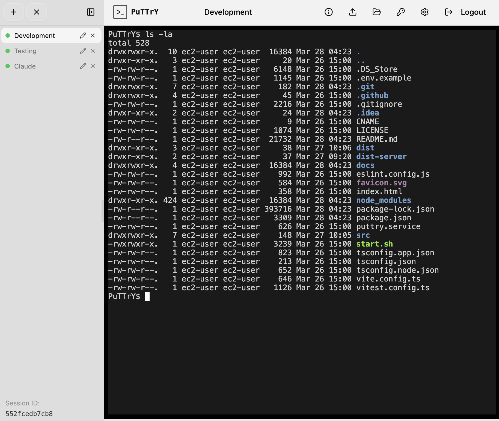
</td>
<td width="50%" align="center">
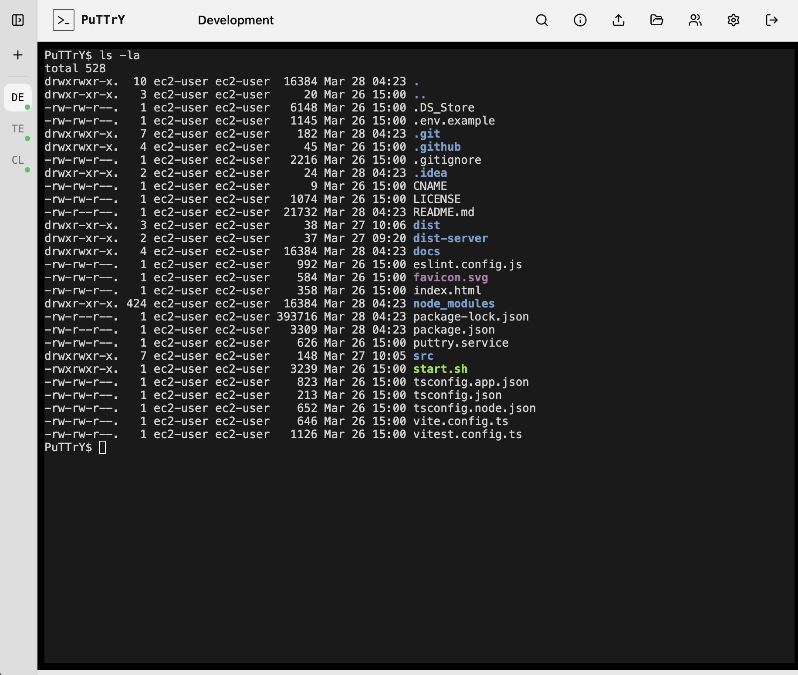
</td>
</tr>
</table>

### Terminal Area (Center)

The main area displays the **active terminal session**. This is where your shell output appears and where you type commands.

- Type commands as you would in any terminal
- **Ctrl+C** sends an interrupt signal (SIGINT) to your shell—works as expected
- **Ctrl+Z** suspends the foreground process
- **Ctrl+L** clears the screen (if your shell supports it)
- Output scrolls automatically as new content arrives
- You can scroll up to see history (the scrollback buffer stores recent output)

### Toolbar (Top)

The toolbar at the top provides quick access to:

- **Toggle Sidebar**: Expand/collapse button on the left
- **Settings**: Gear icon on the right

The terminal tabs (session names) appear between the toggle and settings buttons. Click a tab to switch to that session.

---

## Mobile Browser Usage

PuTTrY works on mobile browsers (iOS Safari, Android Chrome, etc.) with the same features as desktop. The interface adapts to smaller screens and touch interaction, but all core functionality remains available.

### Interface on Mobile

**Sidebar and Layout**

On mobile, the sidebar is **collapsed by default** to maximize terminal viewing area. The session list appears as icons in the top bar. Tap the **hamburger menu** (≡) to expand the sidebar and see full session names.

- **Expanding sidebar**: Tap ≡ to open the full sidebar
- **Collapsing sidebar**: Tap the collapse arrow or anywhere outside the sidebar
- **Switching sessions**: Tap session icons directly, or expand the sidebar and tap a session name

**Toolbar**

The toolbar adapts to mobile width:

- **Left side**: Hamburger menu (≡) to toggle the sidebar
- **Center**: Session names/icons (tap to switch)
- **Right side**: Settings button (⚙️)

**Terminal Area**

The terminal occupies most of the screen on mobile. Pinch to zoom in/out for better readability on small screens.

<table>
<tr>
<td width="33%" align="center">
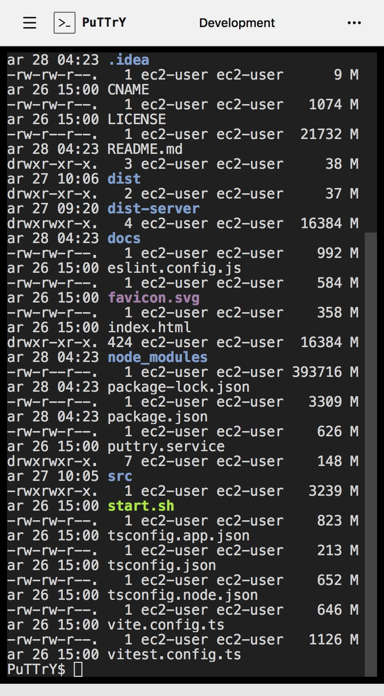
</td>
<td width="33%" align="center">
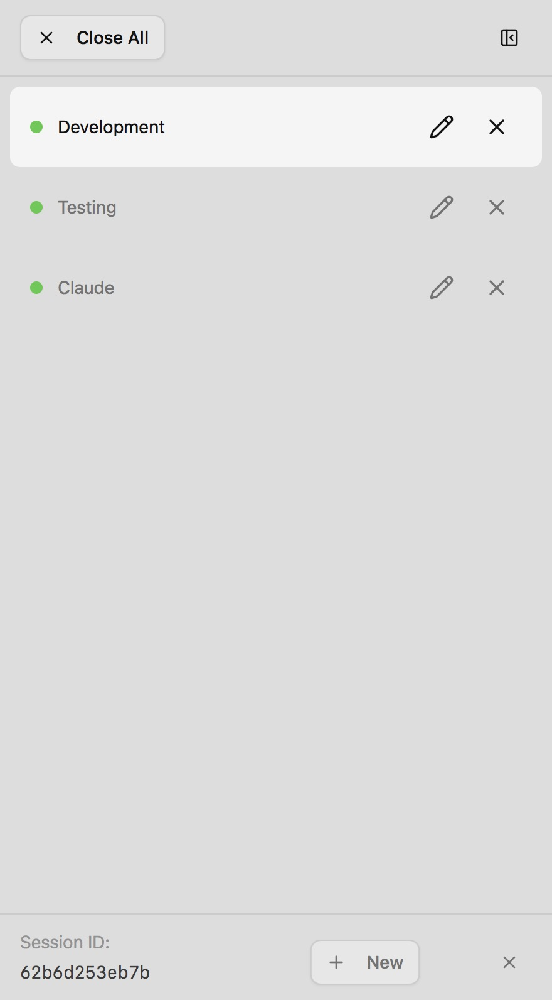
</td>
<td width="33%" align="center">
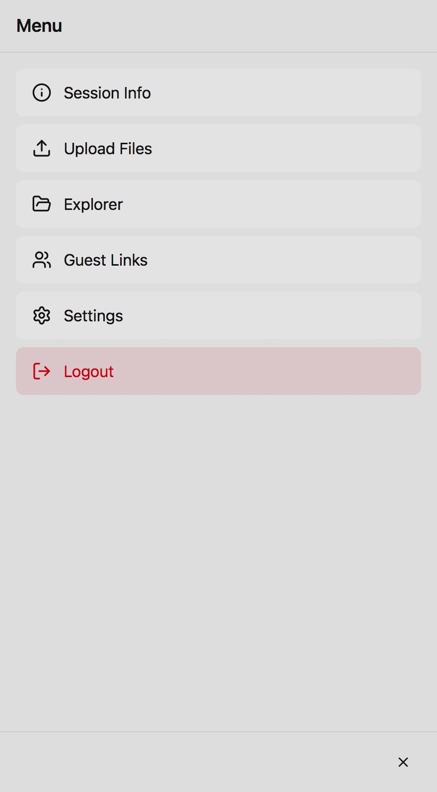
</td>
</tr>
</table>

### Touch Interactions

**Tapping and Holding**

- **Single tap**: Focus the terminal or select UI elements
- **Long-press (hold)**: Equivalent to right-click. Use this to access context menus (e.g., delete a session, take the write lock)

**Scrolling**

- **Scroll up**: See older terminal output (scrollback buffer)
- **Scroll down**: Return to the live output

**Selecting and Copying**

- **Select text**: Long-press on terminal output and drag to select, or triple-tap a line
- **Copy selected text**: Tap the copy button that appears, or use **Ctrl+C** (mapped to keyboard)
- **Paste**: Long-press in the terminal area and select **Paste** (if your browser supports it)

### Floating Keyboard (iOS)

On **iOS (iPhone and iPad)**, PuTTrY displays a **floating software keyboard** that doesn't cover your terminal. This is essential because:

**Why it's needed on iOS:**

iOS has limited control over the system keyboard—it often covers the bottom half of the screen when opened, obscuring terminal output. PuTTrY's floating keyboard:

1. **Stays visible above the terminal** — you see your shell output while typing
2. **Includes terminal-specific keys** — quick access to **Ctrl**, **Tab**, **Escape**, **Arrow keys**, and other common terminal commands
3. **Can be moved** — drag the floating keyboard to reposition it if it blocks important output
4. **Can be minimized** — tap the minimize button to hide it temporarily (swipe from the right edge to bring it back)

**Using the floating keyboard:**

- **Type normally**: The on-screen keyboard behaves like a standard software keyboard
- **Access special keys**: Buttons for **Ctrl+C** (interrupt), **Ctrl+Z** (suspend), **Tab**, **Escape**, and arrow keys
- **Reposition**: Long-press the keyboard header and drag to move it
- **Minimize**: Tap the collapse arrow to hide the keyboard; swipe from the right edge to restore it

**Note:** The floating keyboard is specific to iOS due to platform limitations. Android and desktop browsers use the standard system keyboard without obstruction.

### File Manager on Mobile

The file manager works the same on mobile as desktop, with touch-friendly adjustments:

**Uploading**

- **Tap "Choose Files"** to open your device's file picker
- Select one or multiple files
- Files upload with progress bars visible at the bottom
- No drag-and-drop (not supported on mobile); use the file picker instead

**Downloading**

- **Select files**: Tap to select, tap again to deselect; long-press to toggle
- **Download button**: Appears at the bottom of the screen
- **Save location**: On iOS, files save to the Files app (with File System Access API support on newer iOS versions); on Android, files go to your Downloads folder

### Session Management on Mobile

All session operations work the same on mobile:

- **Create**: Tap the **+** button in the top bar
- **Switch**: Tap session icons or expand the sidebar
- **Rename**: Long-press a session and select **Rename**, or expand the sidebar and double-tap the name
- **Delete**: Long-press a session and select **Delete**, or expand the sidebar and tap the delete button
- **Reorder**: Not available on mobile (drag-and-drop not supported); use the sidebar on desktop if you need to reorder

### Write Lock on Mobile

The write lock (who can type) works the same on mobile. When another browser has control:

- The terminal shows **read-only mode**
- Tap **Take Control** (or equivalent UI) to request the write lock
- Once you have it, type normally into the terminal

### Tips for Mobile Usage

**Landscape Orientation**

Rotate your device to landscape for a wider terminal view. The sidebar auto-collapses to give more horizontal space.

**Keyboard Shortcuts on Mobile**

The floating keyboard (iOS) or system keyboard (Android) provides quick access to terminal commands:

- **Ctrl+C**: Interrupt (stop) the running process
- **Ctrl+Z**: Suspend the foreground process
- **Ctrl+D**: Send EOF (end of file)
- **Tab**: Complete commands or cycle through options
- **Arrow keys**: Navigate command history or move the cursor

**Minimize the Keyboard**

If the floating keyboard blocks important output, minimize it (iOS) or dismiss it (Android) to see the full terminal. You can bring it back anytime.

**Use Zoom for Small Text**

Pinch to zoom in/out on the terminal if text is too small to read comfortably.

**Keep Sessions Running Across Networks**

Mobile networks often switch between WiFi and cellular. Your session persists—if the browser disconnects, simply reconnect and your shell continues running. No interruption to background processes.

---

## Terminal Sessions

A **session** is an independent terminal running on your server. Each session is a separate shell process that keeps running even when you're not viewing it.

### Creating a Session

Click the **+** button at the top of the sidebar, or:

1. From the keyboard, press **Ctrl+N** (if implemented)
2. Enter a name for the session (e.g., "dev", "monitoring", "build")
3. Press **Enter**

The new session is created and immediately becomes active. You can start typing commands.

### Switching Sessions

Click any session tab in the sidebar (or on the toolbar between the toggle and settings) to switch to that session. The terminal displays the selected session's output and scrollback history.

**Background sessions**: When you switch away from a session, it continues running on the server. The shell keeps executing commands, background processes keep running, and output keeps being captured. You just stop receiving real-time updates to save bandwidth.

### Renaming a Session

**Double-click** a session tab to rename it:

1. The name becomes editable
2. Type the new name
3. Press **Enter** to confirm, or **Escape** to cancel

### Reordering Sessions

Click and drag a session tab to reorder it. The new order persists across browser reloads.

### Deleting a Session

Right-click a session tab (or use the expanded sidebar's delete button) to delete it:

1. Confirm that you want to delete the session
2. The shell process is terminated immediately
3. All output for that session is lost
4. If it's the active session, the focus switches to another session

**Note**: You cannot undo deletion. Deleting a session kills the running process and discards history.

---

## Working Across Devices

One of PuTTrY's core strengths is **session continuity**—your shells persist independent of which device or browser you're using.

### Opening the Same Session on Multiple Devices

**On your desktop**, start a long-running process:

1. Open PuTTrY (e.g., `https://puttry-host:5174`)
2. Create a new session called "deploy"
3. Run a command: `npm run deploy`

**From your phone or laptop**, open the same PuTTrY instance:

1. Navigate to the same URL: `https://puttry-host:5174`
2. Log in with your session password
3. The "deploy" session appears in your session list
4. Click it to view real-time output from `npm run deploy`

The shell and process are the same on the server—you're just viewing them from a different device. The process never stops; you're simply reconnecting the browser.

### Shared Output (Multiple Viewers)

When multiple browsers are connected to the same session:

- **All browsers see the same output in real-time**
- When one browser sends input, all browsers see the result
- The output buffer preserves history (default 10,000 lines) so new viewers get context when they connect

This is useful for:

- Monitoring a deployment from your phone while your team watches on their screens
- Debugging a problem together with a colleague—both watching the same terminal

### Write Lock (Who Can Type)

Only **one browser can send input to a shell at any given time**. This prevents chaos when multiple people are typing simultaneously.

#### How It Works

- **Lock holder**: The browser with write access; commands typed here go to the shell
- **Read-only viewers**: Other connected browsers see all output but cannot type
- **Force takeover**: You can force the lock away from another browser anytime—no permission needed, no acknowledgment required

#### Identifying a Locked Session

When another browser has the write lock, the session tab shows a **lock indicator** with the client ID or name of who's controlling it. You can see that the session is locked and read-only:

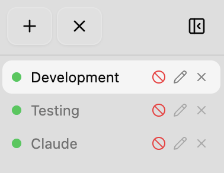

The lock symbol tells you that another browser has write access to this terminal. You cannot type input until you take control.

#### Taking Control

To request write access, click the **lock button** next to the session name. This immediately grants you control, and the other browser becomes read-only:

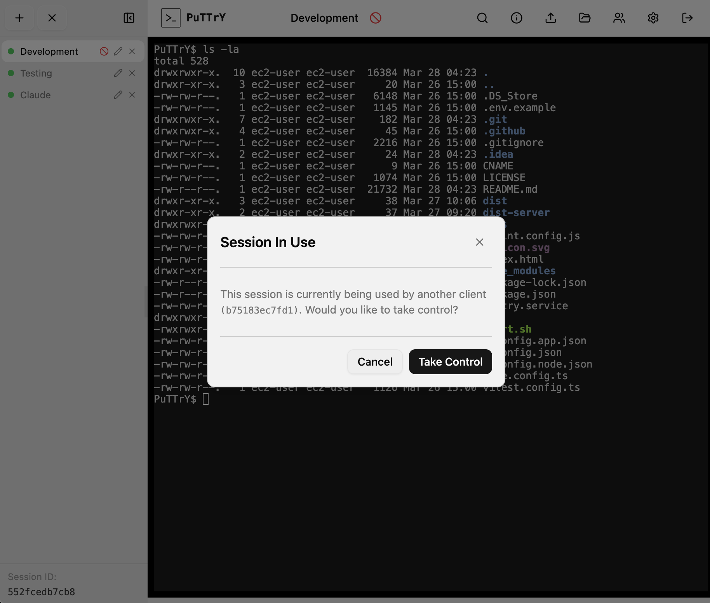

Once you click **Take Control**, the lock is yours. You can now type commands, and the other viewer will see all your output in real-time but won't be able to send input.

**Example scenario:**

1. You start a deployment on desktop (desktop holds the write lock)
2. Your colleague opens the same session on their laptop (read-only)
3. You see an issue and want to stop the deploy
4. You press **Ctrl+C** → you hold the lock, command executes
5. Your colleague takes the lock → they now have control
6. You become read-only until you take the lock back

### Reconnecting After Disconnect

If your browser closes or you lose network connection:

1. Open PuTTrY again and log in (or use an existing tab)
2. Your sessions are still there, still running
3. Click the session to reconnect
4. The scrollback buffer is replayed so you see recent history
5. Real-time output resumes
6. **If you were the write lock holder**: Your browser regains write access automatically if no one else is using it. If another browser has taken the lock, you'll need to explicitly request it.

The shell process never stops—disconnecting from the browser doesn't interrupt your work.

---

## Guest Links

**Guest links** allow you to share temporary access to specific terminal sessions without giving away your main session password. Guests can view—and optionally control—sessions you assign to them, without needing to log in with a password.

This is perfect for:

- Inviting a colleague to debug an issue together without revealing your main credentials
- Giving a team member read-only access to monitor a deployment
- Sharing session access with contractors or temporary staff without creating accounts
- Onboarding new team members without managing separate authentication

### Creating a Guest Link

1. Click the **Guest Links** button (👥 icon) in the top toolbar
2. Click **Create New Link**
3. Enter a **name** for the link (e.g., "Deploy Support", "Team Monitoring")
4. Select **which sessions** this guest can access (you can choose one or multiple sessions)
5. Click **Create**

The link is generated and displayed as a shareable URL, e.g.:
```
https://puttry-host:5174/guest/a1b2c3d4e5f6g7h8
```

You can:
- **Copy the link** to send via Slack, email, or other channels
- **Revoke the link** by deleting it from the list (guests can no longer access)
- **Rename the link** to keep track of different guest sessions
- **Reassign sessions** to update which sessions the guest can view

### Sharing a Guest Link

Send the guest link URL to your team member. When they open it:

1. No login required—the link grants instant access
2. They see the assigned sessions in their sidebar
3. They can view real-time terminal output and switch between assigned sessions
4. They can take control of a session (subject to write lock rules) if you've granted them that ability

**Example:**

You're deploying to production and want a colleague to watch:

1. Create a guest link called "Deploy Monitor"
2. Assign the "production" session to it
3. Send the link: `https://puttry-host:5174/guest/a1b2c3...`
4. Your colleague opens it and sees the production session in real-time
5. If something goes wrong, they can click **Take Control** to help debug
6. When the deployment is done, you delete the link

### What Guests Can Do

Guests with a valid guest link can:

- ✅ **View sessions** assigned to the link
- ✅ **See real-time terminal output**
- ✅ **Request write control** (same write lock system as multiple browsers)
- ✅ **View files** in the file manager (if file access is enabled)
- ❌ Cannot access other sessions (only those you assigned to the link)
- ❌ Cannot create new sessions
- ❌ Cannot change settings or authentication

### Write Control (Guest Input)

Even though a guest is accessing via a guest link:

- **Only one browser can send input at a time** (same write lock as regular sessions)
- If you're typing and the guest takes control, you become read-only (and vice versa)
- Either party can force the write lock from the other
- All output is visible to both simultaneously

This allows seamless collaboration—you can hand off control to a guest, they debug, and you take it back.

### Revoking Guest Access

To immediately revoke a guest's access:

1. Open **Guest Links**
2. Find the link in the list
3. Click **Delete** or **Revoke**

The link is invalidated instantly. The guest can no longer access the sessions—if they're already connected, they'll be disconnected on the next sync update.

### Security Considerations

**Guest links are token-based URLs**—anyone with the link has access. Treat them like passwords:

- **Use HTTPS**: Always share guest links over HTTPS to prevent man-in-the-middle interception
- **Limit session scope**: Only assign sessions the guest actually needs to see
- **Revoke when done**: Delete guest links as soon as the guest no longer needs them
- **Rotate sensitive work**: If a guest link has been exposed, revoke it and create a new one

**Example security best practice:**

- Guest link for "on-call support" → revoked at end of shift
- Guest link for "contractor debugging" → deleted when contractor contract ends
- Guest link for "team monitoring" → kept active for the duration, but scope limited to non-sensitive sessions

### Monitoring Multiple Guests

You can create multiple guest links to different team members, each with different session assignments:

- **Alice** → guest link with access to "frontend" session
- **Bob** → guest link with access to "backend" + "database" sessions
- **Manager** → guest link with read-only access to all sessions (for oversight)

Each guest link is independent—revoking one doesn't affect others.

---

## File Manager

PuTTrY includes an integrated **file manager** for uploading and downloading files directly from your browser, without needing `scp`, `rsync`, or command-line tools.

### Opening the File Manager

The file manager is accessible from the main interface (usually a file icon in the toolbar, or via the settings/menu). It allows you to:

- Browse your home directory (`$HOME`)
- Upload files to any folder
- Download individual files or entire folders as ZIP archives

### Uploading Files

**Drag and drop** files onto the file manager, or click **Choose Files** to open a file picker.

**Features:**

- **Multiple files**: Upload several files at once to the same destination folder
- **Browser compression**: Files smaller than 100 MB are automatically gzip-compressed before upload, speeding up transfers for text and compressible data
- **Progress bars**: Each file shows real-time upload progress
- **Retry support**: If an upload fails, you can retry automatically or manually
- **Upload limit**: Single files up to 512 MB

**Workflow:**

1. Click file manager
2. Navigate to destination folder (e.g., `~/projects/config`)
3. Drag files from your computer into the browser, or click **Choose Files** to open a file picker
4. Watch progress bars as files upload
5. Once complete, files are in the destination folder on your server

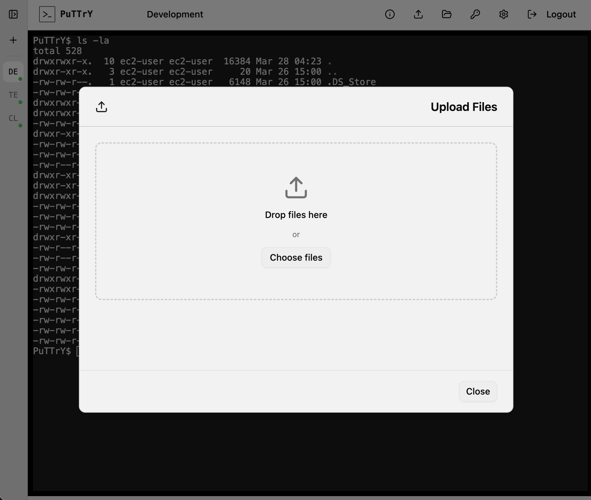

### Browsing Files (Download)

The file manager shows your home directory structure. You can:

- **Navigate folders**: Double-click to enter, or click breadcrumbs to jump to parent folders
- **Select files**:
  - Single-click to select one file
  - **Ctrl+click** (Cmd+click on Mac) to toggle selection
  - **Shift+click** to select a range
- **Download options**:
  - **Single file**: Right-click and download, or select and click **Download**. The file streams from the server with automatic gzip compression for efficiency.
  - **Multiple files or folders**: Select them and click **Download as ZIP**. The selected files and folders are archived and downloaded.

**Size and limits:**

- **Warning threshold**: The browser warns if your selection exceeds 100 MB
- **Download limit**: Single files are limited to 2 GB
- **ZIP downloads**: Multiple files/folders are packaged into a ZIP archive

**File System Access API (Modern Browsers):**

On supported browsers (Chrome, Edge, Safari on macOS 13.1+), you can choose to **save downloads directly to a local folder** instead of your browser's Downloads folder. The browser asks for permission once; subsequent downloads go to your chosen folder.

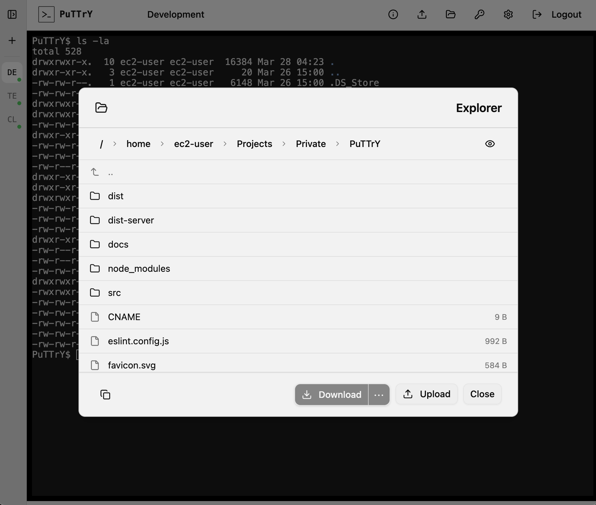

### Security

All file operations are restricted to your home directory (`$HOME`). You cannot:

- Navigate to parent directories (e.g., `..` is blocked)
- Access files outside your home folder
- Bypass Unix file permissions (PuTTrY respects your user's read/write permissions)

Path traversal attacks are blocked server-side—attempting to escape `$HOME` is rejected.

---

## General Settings

Access **Settings** by clicking the gear icon in the top toolbar.

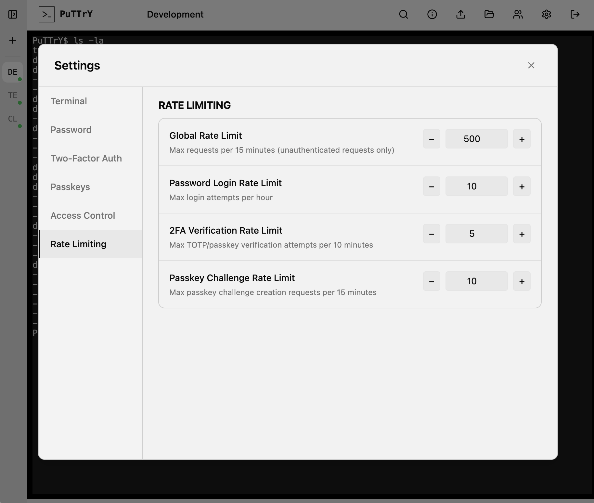

### Scrollback Buffer

The **scrollback buffer** is the amount of terminal history that PuTTrY saves and displays when you reconnect to a session.

When you view a terminal that's been running in the background, PuTTrY replays recent output from the scrollback buffer so you see where you left off, rather than connecting to an empty screen.

**Configuration:**

1. Open Settings → **Terminal** or **Display**
2. Adjust the **Scrollback Lines** value (default: 10,000 lines)
3. Click **Save**

Larger values preserve more history but use more memory. For long-running sessions, 10,000 lines is usually sufficient to see hours of activity.

### Font Size

Adjust the terminal font size for better readability on different devices and screen sizes.

**Configuration:**

1. Open Settings → **Terminal** or **Display**
2. Adjust the **Font Size** slider or enter a value in points
3. Changes apply immediately

Larger font sizes are useful on mobile devices or when viewing from a distance. Smaller sizes fit more content on screen but may be harder to read.

**Note:** Font size is stored per browser—each device can have its own preference.

### Disable Authentication

This toggle **completely bypasses login**—no password, TOTP, or passkey is required. Anyone who can reach the server URL has immediate, full access to your terminal and file manager.

**Use cases:**

- Local development machines where requiring a password adds unnecessary friction
- Air-gapped environments with no external network access
- Single-user testing or throwaway instances

**Configuration:**

1. Open Settings → **Security** or **Authentication**
2. Toggle **Disable Authentication** to ON
3. Click **Save**

When disabled, you can open PuTTrY without logging in—the login screen is bypassed entirely.

⚠️ **CRITICAL WARNING**: Only disable authentication if the PuTTrY server runs on a **private network with no external access**. Never disable on a publicly reachable server. If authentication is disabled, anyone on the same network (or internet, if exposed) can access your terminal without a password and execute arbitrary commands, access files, or compromise the system hosting PuTTrY.

### Show Authentication Disabled Warning

When authentication is disabled, PuTTrY can display a **persistent warning banner** in the UI to remind you that the instance is unprotected.

**What it does:**

- Shows a banner at the top or bottom of the interface stating "⚠️ Authentication is disabled"
- Remains visible while you use the terminal, file manager, and settings
- Helps prevent accidental exposure of an unprotected instance

**When to turn this off:**

- You intentionally run without authentication and don't want the visual noise
- You're confident the server is private and the warning becomes redundant

**Recommendation:**

Leave this toggle **ON** as a safety reminder, especially if you frequently switch between authenticated and unauthenticated instances. The banner takes minimal space but provides a clear visual cue that the instance is open to anyone on the network.

---

## Authentication

Configure how users log in to your PuTTrY instance. You can require multiple authentication factors for stronger security, or use passkeys as a passwordless alternative.

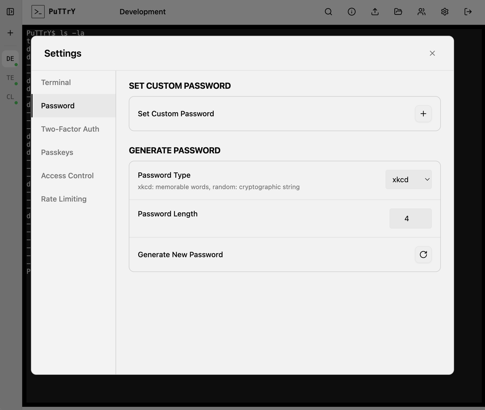

### Changing Your Session Password

To change the password that protects your PuTTrY instance:

1. Open Settings
2. Go to the **Security** or **Password** section
3. Enter your current password to verify
4. Enter your new password
5. Click **Save**

All active browser sessions remain logged in. New logins use the new password.

### Enable / Disable TOTP (2FA)

#### Enable TOTP

1. Open Settings → **Two-Factor Authentication**
2. Click **Enable TOTP**
3. A QR code appears on screen
4. Open your authenticator app and scan the QR code (or enter the setup key manually)
5. The app generates a 6-digit code
6. Enter the code to confirm
7. TOTP is now enabled; future logins will require a 2FA code

#### Disable TOTP

1. Open Settings → **Two-Factor Authentication**
2. Click **Disable TOTP**
3. Your authenticator app still has the secret, but it's no longer required for login
4. If you want to re-enable TOTP, you'll set up a new secret and scan a new QR code

### Registering and Managing Passkeys

Passkeys provide biometric or security key authentication (Touch ID, Face ID, Windows Hello, etc.).

#### Register a Passkey

1. Open Settings → **Passkeys** (or **Security**)
2. Click **Register New Passkey**
3. Your browser prompts you to authenticate with your device (Touch ID, Face ID, Windows Hello, or security key)
4. Complete the authentication
5. Give your passkey a friendly name (e.g., "iPhone Touch ID", "Security Key")
6. Click **Save**

You can register multiple passkeys (e.g., one on your phone, one on your laptop, one security key).

#### Use a Passkey to Log In

**If passkeys are configured as standalone auth** (no password required):

On the login screen, click **Sign in with Passkey**:

1. Your browser prompts you to authenticate
2. Use your device's biometric or security key
3. You're logged in

**If passkeys are configured as 2FA** (in addition to your password):

1. Enter your password first
2. The login screen prompts for passkey authentication
3. Use your device's biometric or security key
4. You're logged in

Your server admin determines which mode is configured.

#### View and Delete Passkeys

In Settings → **Passkeys**, you can:

- **List all passkeys**: See which devices have registered passkeys and when they were registered
- **Delete a passkey**: Remove one or all passkeys (users can then register new ones)

---

## Tips and Common Workflows

### Monitoring a Long-Running Process from Your Phone

Start a deployment or build on your work desktop:

```bash
# On desktop
npm run deploy
```

The terminal runs on the server. From your phone on the train home:

1. Open PuTTrY and log in
2. You see real-time output from the deploy
3. If it fails, you can take control and run recovery commands
4. No process interruption; you're just viewing from a different device

### Handing Off a Session to a Colleague

Your colleague needs to debug an issue you've been investigating.

**Option 1: Guest Link (Recommended)**

Guest links give scoped, temporary access without sharing your main password:

1. Open **Guest Links** (👥 icon)
2. Create a new link and assign the specific session(s) your colleague needs
3. Share the guest link URL with them
4. They open the link—no login needed, instant access
5. **Take turns controlling** the session by requesting and releasing the write lock
6. When done, delete the guest link to revoke access

**Advantages**: Secure, temporary, scoped to specific sessions, easy to revoke.

**Option 2: Share Your Session Password**

If you need to give them full access to all sessions:

1. Share your **session password** with them (via Slack, email, etc.)
2. They open your PuTTrY instance (same host/port)
3. Log in with the shared password
4. They see all your terminal sessions and can view the same output
5. **Take turns controlling** sessions by requesting and releasing the write lock
6. No need to copy command history or reproduce context—they see everything in real-time

**Important**: The session password grants full access to all your sessions. Only share it with people you trust.

**Best practice**: Use guest links for external collaborators or temporary access. Share your session password only with team members you fully trust.

### Recovering from a Browser Crash

You're in the middle of debugging when your browser crashes:

1. Reopen the browser and navigate to PuTTrY
2. Log in (you may still be logged in via the session cookie)
3. Click your session tab to reconnect
4. The scrollback buffer shows recent history
5. Real-time updates resume
6. If another browser had the write lock, take it back
7. Continue working

Your shell and processes never stopped—you're just reconnecting the browser.

### Using the File Manager Instead of scp/rsync

You need to move a large dataset from your local machine to your server:

**Traditional approach:**
```bash
scp large-dataset.tar.gz user@server:~/data/
```

**PuTTrY approach:**
1. Open the file manager in PuTTrY
2. Navigate to `~/data/`
3. Drag `large-dataset.tar.gz` from your computer into the browser
4. Watch the progress bar; automatic compression speeds it up
5. Done—no command line needed

**Downloading results back:**
1. In the file manager, select your results folder
2. Click **Download as ZIP**
3. The entire folder is downloaded as a ZIP archive
4. Extract locally

This is useful when:
- You don't have SSH set up on a device (phone, tablet, borrowed laptop)
- Drag-and-drop is more intuitive than command-line tools
- You want a progress bar while transferring large files

---

## Troubleshooting

### Can't Connect to PuTTrY

**Problem**: Browser shows connection refused or timeout

**Check:**
1. Is the server running? `puttry status` on your server
2. Are you using the correct URL and port? (Check `puttry start` output)
3. If behind a firewall/VPN, is the port accessible?
4. For HTTPS, are you using the correct hostname (must match your certificate)?

### Session Lost / Disconnected

**Problem**: Browser reconnected but sessions are gone

**Root cause**: Server restarted. Sessions persist in memory but not on disk.

**Solution**: If you use background processes, consider starting them via a process manager (systemd, supervisor) that restarts them after server restarts. Or use `nohup` or `&` to keep processes running.

### Can't Take Write Lock

**Problem**: Another browser has the write lock and won't release it

**Solution**: Click **Take Control** to force the write lock from the other browser. This immediately gives you control; the other browser becomes read-only.

### File Upload Too Large

**Problem**: Upload fails with "exceeds size limit"

**Limit**: Single files up to 512 MB

**Solutions:**
- Split the file into smaller chunks before uploading
- Use a command-line tool like `scp` if you need to upload larger files
- Compress the file before uploading (smaller = faster)

### TOTP Code Not Working

**Problem**: 6-digit code rejected at login

**Possible causes:**
1. **Device time is out of sync**: TOTP is time-based. If your phone's clock is significantly off, codes won't match. Sync your device's time.
2. **Code already used**: Each 6-digit code is valid for 30 seconds and can only be used once. Wait for the next code if you submitted the same code twice.
3. **Authenticator app lost**: If you lost access to your authenticator app, contact your server admin to disable TOTP so you can set up a new device.

### Passkey Not Working

**Problem**: Biometric authentication fails at login

**Possible causes:**
1. **Device not registered**: You haven't registered a passkey on this device yet. Go to Settings and register one.
2. **Browser doesn't support WebAuthn**: Use a modern browser (Chrome, Safari, Edge, Firefox). Some older browsers don't support passkeys.
3. **Incorrect RP origin**: Passkeys are tied to the domain they were registered on. If you're accessing PuTTrY from a different domain, the passkey won't work.

### Guest Link Expired or Invalid

**Problem**: Guest opens link but gets an error or sees no sessions

**Possible causes:**
1. **Link was revoked**: You deleted the guest link. Contact the creator to get a new one.
2. **Wrong URL**: Copy-paste error in the guest link URL. Verify the entire URL is correct.
3. **Session was deleted**: The session you assigned to the guest link no longer exists. The creator needs to update or recreate the guest link.

**Solution**: Contact the person who created the guest link to get a valid one.

### Guest Can't Take Write Control

**Problem**: Guest clicks "Take Control" but nothing happens

**Cause**: You (or another browser) hold the write lock. Guests use the same write lock system as regular browsers.

**Solution**: Release the write lock or wait for the current controller to release it. The guest can then take control.

---

## Next Steps

- For **deployment and production setup**, see [Production Guide](./PRODUCTION.md)
- For **network security** (HTTPS, reverse proxy, etc.), see [Network and Infrastructure Security](./NETWORK_SECURITY.md)
- For **security details** (authentication architecture, threat model), see [Security Architecture](./SECURITY_ARCHITECTURE.md)
- For **technical details** (how sessions work, WebSocket communication), see [Technical Architecture](./TECHNICAL_ARCHITECTURE.md)
